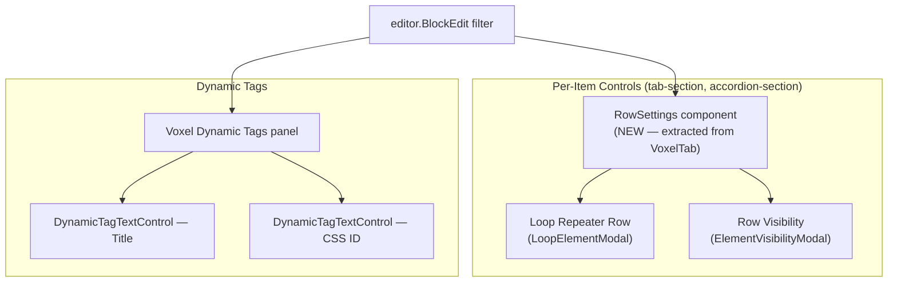

# Voxel Dynamic Tags + Row Settings on NB Tab & Accordion Items

Add per-item **Row Settings** (loop repeater row + row visibility) and **Dynamic Tags** (title, CSS ID) to NB's `tab-section` and `accordion-section` inner blocks.

**No NB plugin code is modified.** All changes are in the voxel-fse theme.

> [!NOTE]
> Widget-level VoxelTab (sticky, visibility, loop on parent blocks like `tabs`, `accordion`, `flex-box`) will be added separately in a batch command across all NB blocks.

## User Review Required


> [!WARNING]
> **Tab title override**: NB stores tab titles as inline text in the save markup. When a dynamic tag is set, the PHP `render_block` filter does HTML string replacement. This approach is fragile if NB changes its markup. An alternative is wrapping the entire block in `@tags()...@endtags()`.

---

## Architecture



---

## Proposed Changes

### New Shared Component

#### [NEW] [RowSettings.tsx](file:///c:/Users/herle/Local%20Sites/musicalwheel/app/public/wp-content/themes/voxel-fse/app/blocks/shared/controls/RowSettings.tsx)

Extracted from VoxelTab — renders just **Loop Repeater Row** and **Row Visibility** as a `PanelBody`:

```tsx
interface RowSettingsProps {
    attributes: {
        loopEnabled?: boolean;
        loopSource?: string;
        loopProperty?: string;
        loopLimit?: string;
        loopOffset?: string;
        visibilityBehavior?: 'show' | 'hide';
        visibilityRules?: any[];
    };
    setAttributes: (attrs: Record<string, any>) => void;
}

export default function RowSettings({ attributes, setAttributes }: RowSettingsProps) {
    // Reuses: ElementVisibilityModal, LoopElementModal
    // from shared/controls (already imported by VoxelTab)
    return (
        <PanelBody title="Row Settings" initialOpen={false}>
            {/* Loop Repeater Row */}
            <SectionHeading label="Loop Repeater Row" />
            <p className="voxel-fse-loop-description">No loop configured</p>
            <Button variant="primary" onClick={() => setIsLoopModalOpen(true)}>
                Edit loop
            </Button>

            {/* Row Visibility */}
            <SectionHeading label="Row Visibility" />
            <SelectControl
                value={attributes.visibilityBehavior ?? 'show'}
                options={[
                    { label: 'Show this row if', value: 'show' },
                    { label: 'Hide this row if', value: 'hide' },
                ]}
                onChange={(val) => setAttributes({ visibilityBehavior: val })}
            />
            <p>No visibility rules added.</p>
            <Button variant="primary" onClick={() => setIsVisibilityModalOpen(true)}>
                Edit rules
            </Button>

            {/* Modals */}
            <LoopElementModal ... />
            <ElementVisibilityModal ... />
        </PanelBody>
    );
}
```

This matches Elementor's layout from the screenshots:
- **Loop Repeater Row**: status line + "Edit loop" button
- **Row Visibility**: "Show this row if" dropdown + rules list + "Edit rules" button

---

### Config

#### [NEW] [nectarBlocksConfig.ts](file:///c:/Users/herle/Local%20Sites/musicalwheel/app/public/wp-content/themes/voxel-fse/app/blocks/shared/filters/nectarBlocksConfig.ts)

```ts
/** NB blocks that get per-item RowSettings (loop + visibility) */
export const NB_ROW_SETTINGS_BLOCKS = [
    'nectar-blocks/tab-section',
    'nectar-blocks/accordion-section',
] as const;

/** Dynamic tag fields per block type */
export const NB_DYNAMIC_TAG_FIELDS: Record<string, { attr: string; label: string }[]> = {
    'nectar-blocks/tab-section': [
        { attr: 'voxelDynamicTitle', label: 'Title' },
        { attr: 'voxelDynamicCssId', label: 'CSS ID' },
    ],
    'nectar-blocks/accordion-section': [
        { attr: 'voxelDynamicTitle', label: 'Title' },
        { attr: 'voxelDynamicCssId', label: 'CSS ID' },
    ],
};
```

---

### Editor Filters

#### [NEW] [nectarBlocksFilters.tsx](file:///c:/Users/herle/Local%20Sites/musicalwheel/app/public/wp-content/themes/voxel-fse/app/blocks/shared/filters/nectarBlocksFilters.tsx)

Single file with two `editor.BlockEdit` HOCs:

**1. Per-item RowSettings** — adds "Row Settings" panel after General Settings:
```tsx
// For tab-section, accordion-section
<InspectorControls>
    <RowSettings attributes={props.attributes} setAttributes={props.setAttributes} />
</InspectorControls>
```

**2. Dynamic Tags** — adds "Voxel Dynamic Tags" panel:
```tsx
// For tab-section, accordion-section
<InspectorControls>
    <PanelBody title="Voxel Dynamic Tags" initialOpen={false}>
        {fields.map(({ attr, label }) => (
            <DynamicTagTextControl
                key={attr}
                label={label}
                value={props.attributes[attr] || ''}
                onChange={(val) => props.setAttributes({ [attr]: val })}
            />
        ))}
    </PanelBody>
</InspectorControls>
```

---

### PHP Backend

#### [NEW] [nectar-blocks-integration.php](file:///c:/Users/herle/Local%20Sites/musicalwheel/app/public/wp-content/themes/voxel-fse/app/blocks/shared/nectar-blocks-integration.php)

1. `register_block_type_args` — injects attributes into all target NB blocks
2. `render_block` — applies visibility, loop, dynamic tag resolution on frontend

---

#### [MODIFY] [Block_Loader.php](file:///c:/Users/herle/Local%20Sites/musicalwheel/app/public/wp-content/themes/voxel-fse/app/blocks/Block_Loader.php)

```diff
 require_once __DIR__ . '/shared/voxel-tab-attributes.php';
+require_once __DIR__ . '/shared/nectar-blocks-integration.php';
```

---

#### [MODIFY] [editorWrapperFilters.tsx](file:///c:/Users/herle/Local%20Sites/musicalwheel/app/public/wp-content/themes/voxel-fse/app/blocks/shared/filters/editorWrapperFilters.tsx)

Extend block name check to also apply sticky styles to NB target blocks.

---

#### [MODIFY] [editor.ts](file:///c:/Users/herle/Local%20Sites/musicalwheel/app/public/wp-content/themes/voxel-fse/app/blocks/src/editor.ts)

```diff
+import '../shared/filters/nectarBlocksFilters';
```

---

## Per-Item Inspector Layout

**Accordion Section** — when selected:
```
Accordion Section
├── General Settings               ← NB (Icon, Font Style, Tag, Indicator, Size, Content Gap)
├── Row Settings                   ← NEW
│   ├── Loop Repeater Row
│   │   ├── "No loop configured"
│   │   └── [Edit loop] button
│   └── Row Visibility
│       ├── [Show this row if ▾]
│       ├── "No visibility rules added."
│       └── [Edit rules] button
├── Voxel Dynamic Tags             ← NEW
│   ├── Title: [EnableTagsButton → DynamicTagBuilder]
│   └── CSS ID: [EnableTagsButton → DynamicTagBuilder]
└── Advanced                       ← NB (Additional CSS Classes)
```

**Tab Section** — when selected:
```
Tab Section
├── General Settings               ← NB (Content Gap)
├── Background                     ← NB (Color)
├── Border                         ← NB (Outline, Corner Radius)
├── Spacing                        ← NB
├── Overflow                       ← NB
├── Block Animation                ← NB
├── Row Settings                   ← NEW
│   ├── Loop Repeater Row
│   │   ├── "No loop configured"
│   │   └── [Edit loop] button
│   └── Row Visibility
│       ├── [Show this row if ▾]
│       ├── "No visibility rules added."
│       └── [Edit rules] button
├── Voxel Dynamic Tags             ← NEW
│   ├── Title: [EnableTagsButton → DynamicTagBuilder]
│   └── CSS ID: [EnableTagsButton → DynamicTagBuilder]
└── Advanced                       ← NB (Additional CSS Classes)
```

---

## Verification Plan

### Build
```bash
npm run build:blocks
```

### Manual Testing
1. Insert NB Tabs → select Tab Section → verify "Row Settings" panel with loop + visibility
2. Insert NB Accordion → select Accordion Section → same "Row Settings" panel
3. Click "Edit loop" → verify LoopElementModal opens
4. Click "Edit rules" → verify ElementVisibilityModal opens
5. Set dynamic tag for Title → verify dark feedback area with EDIT/DISABLE
6. Save → verify frontend renders with visibility/loop applied
