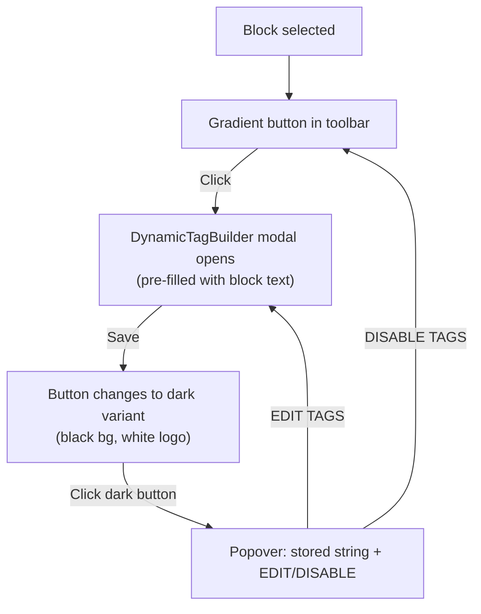

# EnableTag Toolbar Button for NB Text, Heading & Button Blocks

Add the Voxel **EnableTag button** to the block toolbar of NB Text, Heading, and Button blocks — next to NB's existing dynamic content button.

**No NB plugin code is modified.** All changes are in the voxel-fse theme.

## User Review Required

> [!NOTE]
> **Content flow**: Clicking the toolbar button opens the DynamicTagBuilder modal **pre-filled with the block's current text**. The user can then append/mix VoxelScript tags inline with the static text (e.g., `Hello Avy, @post(:reviews.total)...`). The full mixed string is stored as `voxelDynamicContent` and on the frontend replaces the block's rendered text with the resolved result.

---

## UX Flow



---

## Proposed Changes

### Config

#### [MODIFY] [nectarBlocksConfig.ts](file:///c:/Users/herle/Local%20Sites/musicalwheel/app/public/wp-content/themes/voxel-fse/app/blocks/shared/filters/nectarBlocksConfig.ts)

Add toolbar target blocks:
```ts
/** NB blocks that get the EnableTag toolbar button */
export const NB_TOOLBAR_TAG_BLOCKS = [
    'nectar-blocks/text',
    'nectar-blocks/button',
] as const;
```

---

### New Component

#### [NEW] [EnableTagsToolbarButton.tsx](file:///c:/Users/herle/Local%20Sites/musicalwheel/app/public/wp-content/themes/voxel-fse/app/blocks/shared/controls/EnableTagsToolbarButton.tsx)

Two-state toolbar button component:

```tsx
interface EnableTagsToolbarButtonProps {
    value: string;              // Current dynamic tag value
    onChange: (val: string) => void;
}

export default function EnableTagsToolbarButton({ value, onChange }: Props) {
    const [isPopoverOpen, setIsPopoverOpen] = useState(false);
    const [isModalOpen, setIsModalOpen] = useState(false);
    const hasTags = value?.startsWith('@tags()');

    return (
        <>
            <ToolbarButton
                icon={hasTags ? darkVoxelIcon : gradientVoxelIcon}
                className={hasTags ? 'voxel-toolbar-tag--active' : 'voxel-toolbar-tag'}
                onClick={() => hasTags ? setIsPopoverOpen(!isPopoverOpen) : setIsModalOpen(true)}
                title={hasTags ? 'Voxel Dynamic Tag (active)' : 'Enable Voxel tags'}
            />

            {/* Popover with dark panel — shown when tags active */}
            {isPopoverOpen && hasTags && (
                <Popover onClose={() => setIsPopoverOpen(false)}>
                    {/* Dark panel: tag content + EDIT TAGS + DISABLE TAGS */}
                    <DynamicTagPanel
                        value={value}
                        onEdit={() => { setIsPopoverOpen(false); setIsModalOpen(true); }}
                        onDisable={() => { onChange(''); setIsPopoverOpen(false); }}
                    />
                </Popover>
            )}

            {/* DynamicTagBuilder modal */}
            {isModalOpen && (
                <DynamicTagBuilder
                    value={extractTagContent(value)}
                    onChange={(newVal) => { onChange(wrapWithTags(newVal)); setIsModalOpen(false); }}
                    onClose={() => setIsModalOpen(false)}
                    autoOpen={true}
                />
            )}
        </>
    );
}
```

---

#### [NEW] [DynamicTagPopoverPanel.tsx](file:///c:/Users/herle/Local%20Sites/musicalwheel/app/public/wp-content/themes/voxel-fse/app/blocks/shared/controls/DynamicTagPopoverPanel.tsx)

Extracted from `DynamicTagTextControl`'s dark panel — the black rounded box showing tag content with EDIT/DISABLE buttons. Reusable in both the toolbar popover and inspector contexts:

```tsx
interface DynamicTagPopoverPanelProps {
    tagContent: string;
    onEdit: () => void;
    onDisable: () => void;
}

// Renders:
// ┌─────────────────────┐
// │ @post(title)         │ ← tag content (white text on dark bg)
// │─────────────────────│
// │ EDIT TAGS  DISABLE  │ ← action buttons
// └─────────────────────┘
```

---

### Editor Filter

#### [NEW] [nectarToolbarFilter.tsx](file:///c:/Users/herle/Local%20Sites/musicalwheel/app/public/wp-content/themes/voxel-fse/app/blocks/shared/filters/nectarToolbarFilter.tsx)

`editor.BlockEdit` HOC that adds the toolbar button to target NB blocks:

```tsx
const withNectarToolbarTag = createHigherOrderComponent((BlockEdit) => {
    return (props) => {
        if (!NB_TOOLBAR_TAG_BLOCKS.includes(props.name)) return <BlockEdit {...props} />;

        return (
            <>
                <BlockEdit {...props} />
                <BlockControls group="other">
                    <EnableTagsToolbarButton
                        value={props.attributes.voxelDynamicContent || ''}
                        onChange={(val) => props.setAttributes({ voxelDynamicContent: val })}
                    />
                </BlockControls>
            </>
        );
    };
}, 'withNectarToolbarTag');

addFilter('editor.BlockEdit', 'voxel-fse/nectar-toolbar-tag', withNectarToolbarTag);
```

---

### CSS

#### [NEW] [enable-tags-toolbar.css](file:///c:/Users/herle/Local%20Sites/musicalwheel/app/public/wp-content/themes/voxel-fse/app/blocks/shared/controls/enable-tags-toolbar.css)

Toolbar-specific styles:

```css
/* Gradient state — default (no tags) */
.voxel-toolbar-tag {
    /* Uses existing gradient circle from enable-tags-button.css */
}

/* Dark state — tags active */
.voxel-toolbar-tag--active {
    background: rgb(47, 47, 49);
    border-radius: 4px;
    padding: 4px;
}
.voxel-toolbar-tag--active .voxel-fse-enable-tags__icon {
    filter: invert(1); /* White logo on dark bg */
}

/* Popover panel */
.voxel-toolbar-tag-popover {
    width: 260px;
    padding: 0;
}
.voxel-toolbar-tag-popover .edit-voxel-tags {
    border-radius: 10px;
    overflow: hidden;
}
```

---

### PHP Backend

#### [MODIFY] [nectar-blocks-integration.php](file:///c:/Users/herle/Local%20Sites/musicalwheel/app/public/wp-content/themes/voxel-fse/app/blocks/shared/nectar-blocks-integration.php)

Add toolbar target blocks to `register_block_type_args` and `render_block`:

```php
$nb_toolbar_blocks = [
    'nectar-blocks/text',
    'nectar-blocks/button',
];

// Inject voxelDynamicContent attribute
add_filter('register_block_type_args', function($args, $name) use ($nb_toolbar_blocks) {
    if (!in_array($name, $nb_toolbar_blocks)) return $args;
    $args['attributes']['voxelDynamicContent'] = ['type' => 'string', 'default' => ''];
    return $args;
}, 10, 2);

// Resolve dynamic tags in block output
add_filter('render_block', function($content, $block) use ($nb_toolbar_blocks) {
    if (!in_array($block['blockName'], $nb_toolbar_blocks)) return $content;
    $dynamic = $block['attrs']['voxelDynamicContent'] ?? '';
    if (empty($dynamic)) return $content;

    // The stored string is the full mixed content:
    // e.g. "Hello Avy, @post(:reviews.total).is_equal_to(1).then(@value(\) review)..."
    // Wrap with @tags()...@endtags() for resolution
    $wrapped = '@tags()' . $dynamic . '@endtags()';
    $resolved = \Voxel\Dynamic_Tags\Dynamic_Tags::render($wrapped);
    
    // Replace the inner text of the block's HTML wrapper
    return preg_replace('/>(.*?)<\//', ">$resolved</", $content, 1);
}, 15, 2);
```

---

#### [MODIFY] [editor.ts](file:///c:/Users/herle/Local%20Sites/musicalwheel/app/public/wp-content/themes/voxel-fse/app/blocks/src/editor.ts)

```diff
+import '../shared/filters/nectarToolbarFilter';
```

---

## Toolbar Layout

When NB Text block is selected:
```
┌──────────────────────────────────────────────────────┐
│ [NB icons...] [¶] [≡] [P] [F] [~] [⚙ NB] [🟣 Voxel]│  ← gradient = no tags
│                                         or [◾ Voxel]│  ← dark = tags active
└──────────────────────────────────────────────────────┘
```

Clicking dark button opens popover below:
```
┌──────────────────────┐
│ @post(title)          │
│──────────────────────│
│ EDIT TAGS  DISABLE   │
└──────────────────────┘
```

---

## Verification

1. Insert NB Text block → toolbar shows gradient Voxel button on the right
2. Click gradient button → DynamicTagBuilder modal opens
3. Select `@post(title)` → button changes to dark variant
4. Click dark button → popover shows `@post(title)` with EDIT/DISABLE
5. Click EDIT TAGS → modal reopens
6. Click DISABLE TAGS → confirm → button returns to gradient
7. Save → frontend renders resolved tag value
